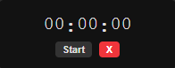

# ⏱️ Minimalist Timer

<div align="center">
  
</div>

## 📝 Repository Description

**Overview:** An ultra-minimalist, distraction-free countdown timer built with Electron. Designed for focused study sessions and productivity.
**Live Project Link:** [Add Live Link/Release Here]
**Tech Stack:** Electron, Node.js, HTML, CSS, JavaScript

---

## 📖 Project Overview

Minimalist Timer is a sleek, transparent, always-on-top countdown timer designed to keep you focused without cluttering your workspace. Built using Electron, it ensures that your timer is always visible, even in full-screen modes, while retaining a persistent state across sessions.

## 💻 Technologies Used

- **Electron**: Framework for building cross-platform desktop applications.
- **Node.js**: JavaScript runtime environment.
- **HTML5, CSS3, Vanilla JavaScript**: Core web technologies used for a lightweight and performant frontend experience.

## ✨ Key Features

- **Minimalist Design**: A tiny, sleek window that displays only essential information.
- **Always-On-Top**: Stays visible above all other windows and applications.
- **Persistent State**: Automatically saves remaining time when closed and resumes where you left off.
- **Keyboard Friendly**: Quick keyboard interactions for setting and controlling the timer.
- **No Decorations**: Transparent, frame-less window for a clean and unobtrusive look.

## 📦 Dependencies

The project utilizes the following main dependencies (refer to `package.json` for details):
- `electron` (^30.0.1) - The core framework.
- `electron-builder` (^24.13.3) - Used for packaging and distributing the application.

## 🚀 How to Run Locally

### Prerequisites
- [Node.js](https://nodejs.org/) (v16 or higher recommended)
- Git

### Installation Steps

1. **Clone the repository:**
   ```bash
   git clone https://github.com/yourusername/minimalist-timer.git
   cd minimalist-timer
   ```

2. **Install the dependencies:**
   ```bash
   npm install
   ```

3. **Run the application:**
   ```bash
   npm start
   ```

## 🛠️ Build and Distribution

To package the application into a distributable format:

```bash
# Package for the current platform without building an installer
npm run pack

# Build installers (e.g., Windows setup executable)
npm run dist
```

## 🔗 Relevant Links

- **Live Project / Download**: [Insert Download/Release Link Here]
- **GitHub Repository**: [Insert Repository Link Here]

## 📄 License

This project is licensed under the ISC License.
